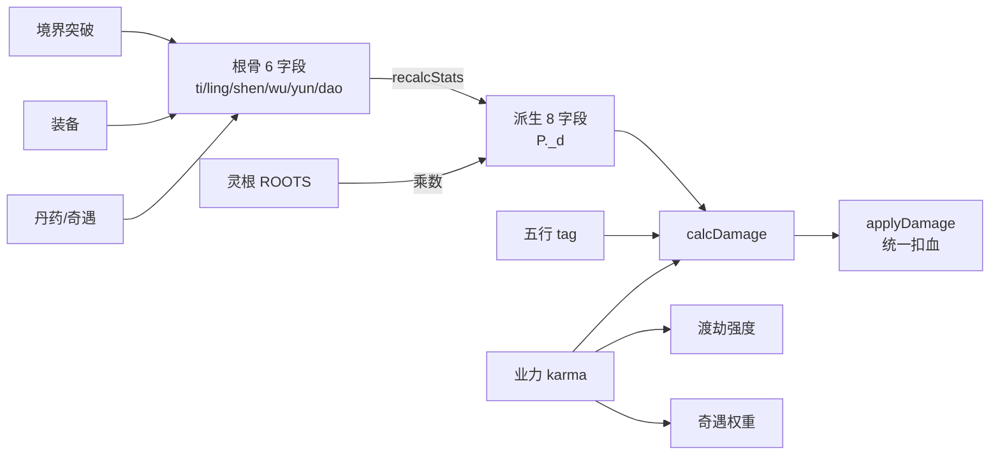

## 用户需求

当前游戏属性体系过于单薄（只有 atk / def / hp / dx），战斗只剩"互砍"，无法体现 MMORPG 的策略深度与修仙小说的味道。需要参考 MMORPG（DNF/魔兽/原神）+ 修仙小说（凡人流/遮天/斗破）体系，**全量重构属性体系并改造战斗结算**，把"修为/灵根/功法/丹药"这些资源最终都变成有差异化体感的数值。

## 产品概述

在 `index.html` 单文件内引入 **三层属性架构** + **业力 / 五行 / 真元 / 先手 / 暴击 / 破防** 六大新机制，替换现有线性伤害公式，重写突破 / 装备 / 神通 / 怪物的数值产出口径。新增「玄机」详情面板展示六根骨与八派生，主面板默认仅显示 4 个核心数。**采用清档版本号策略**，旧存档自动失效，研发期一步到位。同步更新 `whitepaper.html` 数值章节。

## 核心功能

1. **六大根骨主属性**：体魄/灵力/神识/悟性/气运/道行，由境界、灵根、装备、丹药、奇遇加成
2. **八大派生属性**：maxHp / maxMp / atk / def / spd / crit / critDmg / pen，由根骨自动计算
3. **真元（mp）系统**：神通施放消耗 mp，无 mp 强制普攻，闭关 / 丹药恢复
4. **先手 + 暴击 + 闪避 + 破防**：spd 差 ≥30% 多打一次；非线性减伤 `atk × (1 − def/(def+K) × (1−pen%))`
5. **五行相克**：金木水火土 tag 打到灵根 / 神通 / 怪物 / 装备，相克 +20% / 被克 −20%
6. **业力（karma）系统**：杀生 / 灭门 −karma；行善 / 救人 +karma；正业力触发善缘奇遇与渡劫减伤，负业力增加天劫强度与负面奇遇率
7. **新「玄机」详情面板**：折叠展示六根骨 + 八派生 + 业力 + 五行，hover 提示派生公式
8. **暴击 / 闪避动画**：战斗 log 染色 + 关键词高亮（"暴击！" "闪避！" "破防！" "相克！"）
9. **同步白皮书**：`whitepaper.html` 属性章节重写，与代码数值一致

## 技术栈

延续 `index.html` 单文件原生 JS + 内联 CSS，零依赖。所有改动集中在 `index.html`，同步改 `whitepaper.html` 文档章节。

## 实现策略

### 总体思路

**单一可信源**：六根骨（ti/ling/shen/wu/yun/dao）是唯一持久化数值，八派生属性 **每次访问通过 `recalcStats(P)` 重算**，不持久化，避免双写不一致。所有"加属性"操作（突破 / 装备 / 丹药 / 奇遇）都改为加根骨而非直接加 atk。

**战斗管线重写**：抽出 `calcDamage(attacker, defender, skill)` 单一入口，内部依次走 命中→闪避→五行→暴击→破防→减伤，所有伤害扣血点（行 783 / 1275 / 1783）统一改调此函数，杜绝散点公式。

### 关键技术决策

- **派生属性懒计算 + 缓存**：`recalcStats(P)` 在「装备变化 / 突破 / 服丹 / 奇遇」后主动调用一次，结果挂在 `P._d` 上；`atk(P)` / `def(P)` / `maxHp(P)` 等 getter 全部读 `P._d`，零额外开销。**不**每帧重算。
- **清档版本号**：新增 `const SAVE_VERSION = 2;` 写入存档，`loadGame()` 读到 ≠2 直接清档并 toast 提示，避免老存档 atk/def 字段进入新公式爆雷。
- **五行 tag 数据驱动**：`ROOTS / TECHS / EQUIPS / MONSTERS` 每条加 `el: "金"|"木"|"水"|"火"|"土"|null`，相克表 `EL_VS = {金:"木", 木:"土", 土:"水", 水:"火", 火:"金"}`，战斗时一行查表。
- **业力事件钩子**：`onKarma(delta, reason)` 集中入口，奇遇 / 杀怪 / 任务 调它而非直接 `P.karma+=`，便于后续接入"善缘 / 业障"成就。
- **真元最低保护**：`maxMp` 至少 50，回蓝公式 `闭关每日 +ling*0.5`；战斗内每回合 +5%maxMp，避免无限断蓝卡死。
- **先手实现**：战斗 tick 由"双方各 1 回合"改为"按 spd 比例分配回合数"，`extraTurn = floor(spdA/spdB) - 1`（上限 1），最小改动。
- **怪物数值同步**：`MONSTERS` 数据全部加 spd / crit / el / karmaDrop 字段，旧 `mhp/atk` 保留并按新公式重平衡（atk × 0.8、def × 1.2 缓冲）。
- **UI 零侵入主面板**：主面板四宫格不变（hp/mp/atk/def），新增「玄机」按钮弹出详情面板，避免主面板信息过载。
- **业力影响渡劫**：`startTribulation` 行 1166 内，`bonus -= karma/200`（正业力减伤、负业力增伤），不动调用方。

### 性能与可靠性

- `recalcStats` O(根骨数 + 装备数) ≈ O(10)，每次主动触发，全程序 < 50 次 / 局，零性能压力。
- `calcDamage` 内部纯函数，无副作用，便于单元自测（控制台 `DEV.simBattle()` 可直接打印 1000 回合统计）。
- 五行相克查表 O(1)；暴击 / 闪避用 Math.random < threshold 单次 roll。
- 旧存档清档时弹 confirm 而非静默删，给玩家备份机会（即使是研发期）。

## 实现要点（防回归）

- **散点伤害归一**：行 783 / 1275 / 1783 全部改调 `applyDamage(target, calcDamage(...))`，禁止 plan 外再出现 `hp -= xxx` 字面量。
- **getter 兼容层**：临时保留 `P.atk` 字段（值为 base 攻击修正），`totalAtk(p)` 改读 `p._d.atk`，老调用方零修改。
- **奇遇事件改根骨**：行 891 `p.atk += 5` 改为 `p.ti += 1`（+1 体魄派生约等于 +8 maxHp + 1.5 def），数值由 plan 给出对照表。
- **业力上下限**：`karma ∈ [-100, +100]`，超出截断；UI 用进度条 + 善 / 恶双色显示。
- **战斗日志染色**：复用现有 `log(msg, type)` 的 type 参数，新增 `crit` / `dodge` / `el` / `karma` 四种 CSS class。
- **白皮书同步**：`whitepaper.html` 属性章节同改，避免文档与代码漂移。
- **Dev 面板兼容钩子**：在 DEV 命名空间预留 `DEV.setStat(name, v)` / `DEV.setKarma(v)` / `DEV.setEl(el)` 三个空函数，等 dev-panel plan 执行时直接接 UI，无需回头改本期代码。

## 架构设计



## 目录结构

```
project-root/
├── index.html        # [MODIFY] 主战场，按区块改：
│                     #  顶部常量区（行 ~320）：
│                     #    - 新增 SAVE_VERSION=2、ELEMENTS / EL_VS / EL_NAME 五行常量
│                     #    - ROOTS 每条加 el + statBonus（六根骨乘数）
│                     #    - TECHS 每条加 el + mpCost + atkRatio
│                     #    - EQUIPS 每条加 el + statBonus（替换原 atk/def 字段）
│                     #    - MONSTERS 每条加 el + spd + crit + karmaDrop
│                     #    - 新增 BASE_STATS 六根骨初始值表（按境界）
│                     #  玩家初始化（newGame 内）：
│                     #    - 新增 ti/ling/shen/wu/yun/dao/karma/mp/maxMp 字段
│                     #    - 调 recalcStats(P) 完成首次派生
│                     #  新增函数区（行 ~640 战斗工具函数附近）：
│                     #    - recalcStats(p): 六根骨→八派生，含装备/灵根/境界乘数
│                     #    - calcDamage(atk, def, skill): 命中/闪避/五行/暴击/破防/减伤
│                     #    - applyDamage(target, dmg, src): 统一扣血 + log 染色
│                     #    - elMatch(a, b): 五行相克判定，返回 1.2 / 0.8 / 1
│                     #    - onKarma(delta, reason): 业力变更入口 + UI 反馈
│                     #    - regenMp(p, ratio): 真元恢复
│                     #  战斗扣血点（行 783 / 1275 / 1783）：
│                     #    - 全部替换为 applyDamage(...)
│                     #  totalAtk/totalDef（行 645/661）：
│                     #    - 改为读 p._d.atk / p._d.def
│                     #  突破 actBreakthrough（行 1133）：
│                     #    - maxHp += 改为 ti += 5 + realmIdx，调 recalcStats
│                     #  渡劫 startTribulation（行 1166）：
│                     #    - bonus 公式叠加 karma 影响
│                     #  奇遇事件（行 891-1006）：
│                     #    - 所有 p.atk += / p.maxHp += 改为加根骨
│                     #    - 善恶事件触发 onKarma
│                     #    - 心魔化身 totalAtk(p)*0.6 改为读 p._d.atk
│                     #  自动战斗 tick（行 2271）：
│                     #    - 加入 mp 不足切普攻分支
│                     #    - 加入 spd 先手判定
│                     #  存档 saveGame/loadGame：
│                     #    - 写入 SAVE_VERSION，读时校验，不符清档
│                     #    - 持久化字段白名单加 ti/ling/shen/wu/yun/dao/karma/mp
│                     #  UI refresh()（行 1937）：
│                     #    - 主面板加 mp 条
│                     #    - 新增 #panel-stats 玄机详情折叠面板渲染
│                     #  CSS 内联（顶部 <style>）：
│                     #    - 新增 .log-crit/.log-dodge/.log-el/.log-karma 染色
│                     #    - 新增 .stat-grid / .karma-bar / .el-tag 样式
│                     #    - 新增 .mp-bar 蓝色条
│                     #  HTML body：
│                     #    - 主面板增加「玄机」按钮 + #panel-stats 容器
│                     #    - DEV 命名空间预留 setStat/setKarma/setEl 空钩子
└── whitepaper.html   # [MODIFY] 同步属性章节：
                      #    - 新增「三层属性体系」说明
                      #    - 新增「五行相克」「业力系统」「真元」章节
                      #    - REALMS / MONSTERS 数值表同步更新
```

## 关键代码结构

```js
// 五行常量（金克木，木克土，土克水，水克火，火克金）
const EL_VS = { 金:"木", 木:"土", 土:"水", 水:"火", 火:"金" };

// 派生属性重算：六根骨 → 八派生
function recalcStats(p) {
  // 输入：p.ti/ling/shen/wu/yun/dao + 装备 + 灵根 + 境界
  // 输出：p._d = { maxHp, maxMp, atk, def, spd, crit, critDmg, pen }
  // 调用时机：装备变化 / 突破 / 服丹 / 奇遇 / loadGame
}

// 单一伤害计算入口
function calcDamage(attacker, defender, skill) {
  // 顺序：命中 roll → 闪避 roll → 五行系数 → 暴击 roll
  //      → 破防穿透 → 非线性减伤 atk*(1 - def/(def+K)*(1-pen))
  // 返回：{ dmg, isCrit, isDodge, elBonus, log: "..." }
}

// 业力变更入口
function onKarma(delta, reason) { /* 含上下限截断 + log + UI */ }
```

## Agent Extensions

### SubAgent

- **code-explorer**
- Purpose: 在改造伤害管线时，全局扫描 `index.html` 中所有 `.hp -=` / `.mhp -=` / `p.atk +=` / `p.maxHp +=` 字面量出现位置，确保散点公式归一无遗漏；并梳理 `MONSTERS` 数据每条字段，输出新数值（el / spd / crit / karmaDrop）的对照表草稿。
- Expected outcome: 输出"伤害扣血点全清单（带行号）" + "MONSTERS 字段补全建议表"两份产物，作为 todo `dmg-pipeline` 与 `data-tags` 的输入，杜绝改漏。